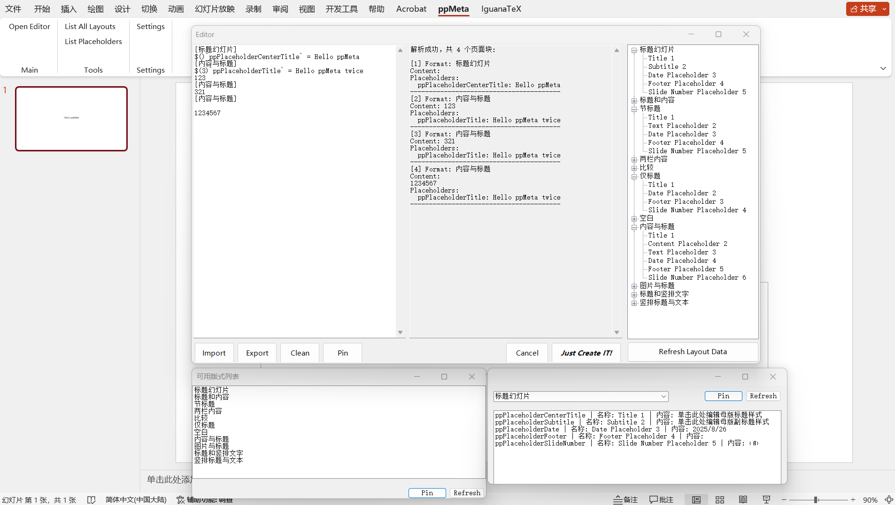

# ppMeta

## Introduction

ppMeta = (PowerPoint->ppt->pp) + (Meta Data to Create Slide -> Meta)

注意：未测试在类Unix系统下的可用性。



## Installation & Uninstallation & Update

1. 你需要先将vsto文件与同名dll放在合适且不会再改变的位置（dll的改变可能导致插件无法正常加载）
2. 双击.vsto文件
3. 安装完成，ready to go :)
4. 卸载：从控制面板像卸载普通软件一样卸载就好了
5. 直接替换dll，不行的话试试卸载旧版，重装新版（记得备份配置）

## Usage

你可能需要一份设置完善的幻灯片母版。

打开config进行设置（一般可以不用）

打开编辑器开始编写代码，语法规范可见 ppLang Syntax 部分，可以右键右侧树状图的任何节点以快捷复制layout/placeholder格式。

完成编辑后点击`Just Create it!`即可生成幻灯片，如有报错，按报错修改即可。

编辑器右边可以实时看到你的代码经过parser后得到的内容，方便更好排版。

你的代码在PowerPoint窗口打开期间都会被保存，你可能需要`Import`与`Export`进行导入或导出以跨pptx文件共享。

鼠标中键单击`Clean`按钮将会清除当前编辑器所有的代码（注意是中键，我们认为这是比确认框更好的防误触方式），当然你可以全选删除。

当母版发生改变，可能需要点击刷新按钮以刷新窗口所展示的Layout或者Placeholder。请注意：任何对母版中Placeholder的改变都可能使当前或以前的pplang代码失效，因为ppMeta使用一种愚蠢的方式定位Placeholder（按类别分组而后排序），Placeholder的改变可能导致Placeholder的顺序发生变化。

## ppLang Syntax

强烈建议打开Editor边看边敲以便快速上手。

以下的版式与占位符名字不一定与实际一致，你应该从树状图中右键单击复制而不是直接复制样例代码。

ppLang暂时不支持注释，示例中的注释仅供说明使用。

ppLang 是一种用于批量生成 PowerPoint 幻灯片的特定语言，通过定义版式和占位符内容来快速创建幻灯片。

### 基本结构

ppLang 代码由**版式块（Format Block）**组成，每个版式块包含：
1. **版式声明**：`[版式名称]`
2. **占位符变量定义**：`$`变量名` = 值`
3. **幻灯片内容**：填充到占位符的文本内容

### 1. 版式声明

版式声明使用方括号包围版式名称，版式名称必须与 PowerPoint 母版中的自定义版式名称完全匹配。

**语法：**
```
[版式名称]
```

**示例：**
```
[标题幻灯片]
这是标题幻灯片的内容

[内容幻灯片]
这是内容幻灯片的内容
```

### 2. 占位符变量

占位符变量用于向幻灯片的特定占位符填充内容。变量名对应占位符的类型和索引。

#### 2.1 变量语法

**基本语法：**
```
$`变量名` = 值
```

**多行值语法：**
```
$`变量名` = {
多行内容
可以包含换行
}
```

#### 2.2 变量作用域

ppLang 支持三种作用域的变量：

##### 当前作用域（默认）
- **语法：** ```$`变量名` = 值``` 或者 ```$()\`变量名\` = 值```
- **作用范围：** 仅在当前版式块中有效
- **示例：**
```
[标题幻灯片]
$`ppPlaceholderType_msoPlaceholderTitle` = 我的标题
这是幻灯片内容
```

##### 全局作用域
- **语法：** ```$(G)`变量名` = 值``` 或 ```$(g)`变量名` = 值```
- **作用范围：** 在所有后续版式块中有效
- **示例：**
```
$(G)`ppPlaceholderType_msoPlaceholderTitle` = 全局标题

[幻灯片1]
这是第一张幻灯片

[幻灯片2] 
这是第二张幻灯片，也会使用全局标题
```

##### 临时作用域
- **语法：** ```$(N)`变量名` = 值```（N 为正整数，表示生效的版式块数量）
- **作用范围：** 在接下来的 N 个版式块中有效
- **示例：**
```
$(3)`ppPlaceholderType_msoPlaceholderTitle` = 临时标题

[幻灯片1]
内容1，使用临时标题

[幻灯片2]
内容2，使用临时标题

[幻灯片3]
内容3，使用临时标题

[幻灯片4]
内容4，此时临时标题已失效
```

### 3. 转义字符

当需要在内容中使用特殊字符时，使用反斜杠进行转义：

- `\[` - 转义左方括号
- `\]` - 转义右方括号  
- `\$` - 转义美元符号

**示例：**
```
[示例版式]
这里需要显示 \[方括号\] 和 \$美元符号
```

### 4. 完整示例

```
// 全局变量定义
$(G)`ppPlaceholderType_msoPlaceholderTitle` = 产品介绍
$(G)`author` = 张三

// 临时变量定义（在接下来3个版式块中有效）
$(3)`ppPlaceholderType_msoPlaceholderSubtitle` = 2024年度报告

[封面页]
$`ppPlaceholderType_msoPlaceholderBody` = {
欢迎参加产品介绍会
主讲人：张三
时间：2024年1月1日
}

[目录页]
$`ppPlaceholderType_msoPlaceholderBody` = {
1. 产品概述
2. 核心功能
3. 技术架构
4. 市场前景
}

[产品概述]
$`ppPlaceholderType_msoPlaceholderBody` = {
我们的产品是一款革命性的解决方案
具有以下特点：
- 高性能
- 易使用
- 可扩展
}

[功能详情]
// 临时变量已过期，需要重新定义标题
$`ppPlaceholderType_msoPlaceholderSubtitle` = 核心功能介绍
$`ppPlaceholderType_msoPlaceholderBody` = {
核心功能包括：
1. 数据处理：高效的数据处理引擎
2. 用户界面：直观的操作界面
3. 集成能力：与现有系统无缝集成
}
```

### 5. 注意事项

1. **版式名称匹配**：版式名称必须与 PowerPoint 母版中的自定义版式完全匹配，区分大小写
2. **占位符识别**：使用右侧树状图查看可用的占位符名称，可右键复制
3. **变量优先级**：当前作用域 > 临时作用域 > 全局作用域
4. **母版依赖**：占位符的顺序依赖于母版中的定义，修改母版可能导致代码失效
5. **空行处理**：版式块外的空行和注释行会被忽略
6. **内容换行**：版式块内的内容会保持原有的换行格式


## Known Issue (当前存在的问题)


## 声明

本项目部分代码由生成式人工智能生成，但经过人工核查，保证无恶意代码。

本项目仅有pplang的Parser有部分测试覆盖，部分功能在边缘情况可能不能按照预期工作。

本项目采用MIT协议开源。二次分发需署名: [仓库链接](https://github.com/zentialEdwardSu/ppmeta)

本项目存在一些问题（已知问题节中展示的或未被发现的），未被发现的可通过github的issue或者邮件至hi@edwardsu.me反馈（请详细说明bug与复现方式以及自己的系统环境，邮件标题需标明issue）。

本项目暂时不接收feature request，但是接收任何形式的pull request (完善文档docs / 添加新功能feat / 改进注释chore / 修复已知的问题bugfix)。

我们同样强烈支持作为大佬的你自己继续开发并以自己的名义分发（It's only fair that your hard work pays off）！如果能让我们知道就更好了，我们会将你的仓库或者任何指向你的项目的链接放在readme的`## DaLao's Improvement`部分。